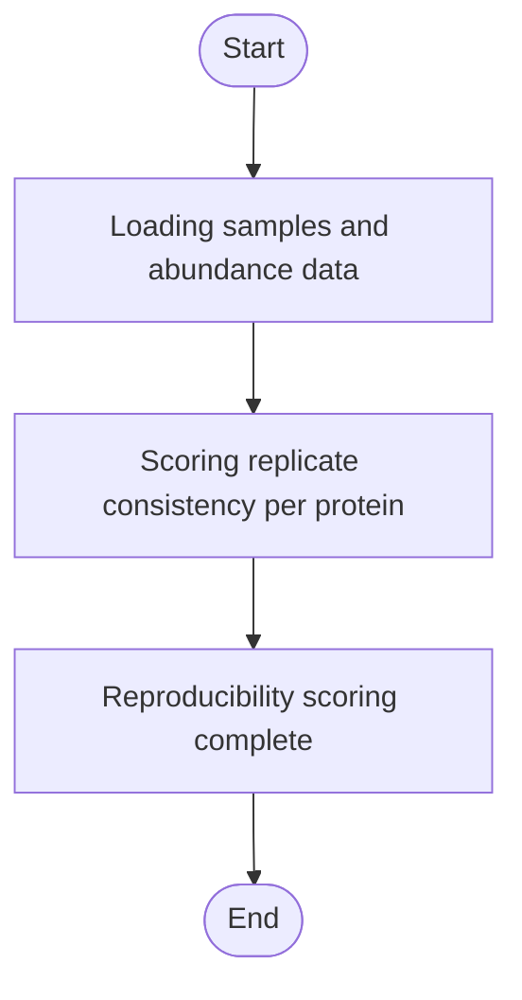

# Lyso-IP Reproducibility


## Installation

**[⬇️ Click here to install in Cauldron](http://localhost:50060/install?repo=https%3A%2F%2Fgithub.com%2Fnoatgnu%2Flysoip-reproducibility-plugin)** _(requires Cauldron to be running)_

> **Repository**: `https://github.com/noatgnu/lysoip-reproducibility-plugin`

**Manual installation:**

1. Open Cauldron
2. Go to **Plugins** → **Install from Repository**
3. Paste: `https://github.com/noatgnu/lysoip-reproducibility-plugin`
4. Click **Install**

**ID**: `lysoip-reproducibility`  
**Version**: 1.0.0  
**Category**: lysoip-qc  
**Author**: CauldronGO Team

## Description

Per-protein replicate consistency score within the IP and WCL groups for lyso-IP data


## Workflow Diagram



## Runtime

- **Environments**: `python`

- **Entrypoint**: `lysoip_reproducibility.py`

## Inputs

| Name | Label | Type | Required | Default | Visibility |
|------|-------|------|----------|---------|------------|
| `abundance_long_file` | Protein Abundance (Long Format) | file | Yes | - | Always visible |
| `samples_file` | Samples | file | Yes | - | Always visible |

### Input Details

#### Protein Abundance (Long Format) (`abundance_long_file`)

abundance_long.tsv from the Lyso-IP Ingestion plugin


#### Samples (`samples_file`)

samples.tsv from the Lyso-IP Ingestion plugin


## Outputs

| Name | File | Type | Format | Description |
|------|------|------|--------|-------------|
| `reproducibility` | `reproducibility.tsv` | data | tsv | Per-protein reproducibility score (average of IP and WCL replicate consistency, 1/(1+CV)) |

## Requirements

- **Python Version**: >=3.11

## Example Data

This plugin includes example data for testing:

```yaml
  samples_file: examples/samples.tsv
  abundance_long_file: examples/abundance_long.tsv
```

Load example data by clicking the **Load Example** button in the UI.

## Usage

### Via UI

1. Navigate to **lysoip-qc** → **Lyso-IP Reproducibility**
2. Fill in the required inputs
3. Click **Run Analysis**

### Via Plugin System

```typescript
const jobId = await pluginService.executePlugin('lysoip-reproducibility', {
  // Add parameters here
});
```
